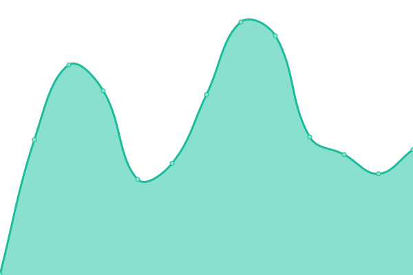
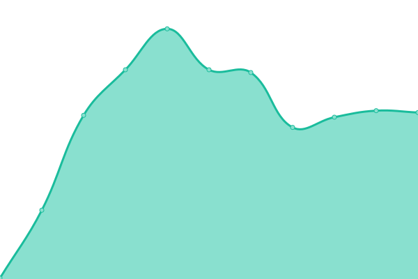
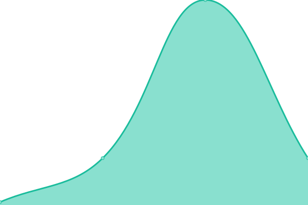

# [📈 Live Status](https://demo.upptime.js.org): <!--live status--> **🟧 Partial outage**

<!--start: status pages-->
<!-- This summary is generated by Upptime (https://github.com/upptime/upptime) -->
<!-- Do not edit this manually, your changes will be overwritten -->
<!-- prettier-ignore -->
| URL | Status | History | Response Time | Uptime |
| --- | ------ | ------- | ------------- | ------ |
|  [MPC Homepage](https://www.minorplanetcenter.net) | 🟩 Up | [mpc-homepage.yml](https://github.com/Smithsonian/upptime/commits/HEAD/history/mpc-homepage.yml) | 

 243ms
     
 | 

<a href="https://Smithsonian.github.io/upptime/history/mpc-homepage">100.00%</a>
    

|  [NEOCP](https://minorplanetcenter.net/iau/NEO/toconfirm_tabular.html) | 🟩 Up | [neocp.yml](https://github.com/Smithsonian/upptime/commits/HEAD/history/neocp.yml) | 

 251ms
     
 | 

<a href="https://Smithsonian.github.io/upptime/history/neocp">100.00%</a>
    

|  [Data Subdomain](https://data.minorplanetcenter.net/) | 🟩 Up | [data-subdomain.yml](https://github.com/Smithsonian/upptime/commits/HEAD/history/data-subdomain.yml) | 

 268ms
     
 | 

<a href="https://Smithsonian.github.io/upptime/history/data-subdomain">100.00%</a>
    

|  [Public VM Test](https://mpc-vm10.cfa.harvard.edu) | 🟩 Up | [public-vm-test.yml](https://github.com/Smithsonian/upptime/commits/HEAD/history/public-vm-test.yml) | 

 279ms
     
 | 

<a href="https://Smithsonian.github.io/upptime/history/public-vm-test">100.00%</a>
    

|  [Designation Identifier API](https://data.minorplanetcenter.net/api/query-identifier) | 🟩 Up | [designation-identifier-api.yml](https://github.com/Smithsonian/upptime/commits/HEAD/history/designation-identifier-api.yml) | 

 158ms
     
 | 

<a href="https://Smithsonian.github.io/upptime/history/designation-identifier-api">16.30%</a>
    

|  [Website Server](mpcweb2.si.edu) | 🟥 Down | [website-server.yml](https://github.com/Smithsonian/upptime/commits/HEAD/history/website-server.yml) | 

 0ms
     
 | 

<a href="https://Smithsonian.github.io/upptime/history/website-server">0.00%</a>
    

|  [Data Subdomain Server](mpcweb6.cfa.harvard.edu) | 🟩 Up | [data-subdomain-server.yml](https://github.com/Smithsonian/upptime/commits/HEAD/history/data-subdomain-server.yml) | 

 16ms
     
 | 

<a href="https://Smithsonian.github.io/upptime/history/data-subdomain-server">0.53%</a>
    

<!--end: status pages-->

## 📄 License

- Powered by: [Upptime](https://github.com/upptime/upptime)
- Code: [MIT](./LICENSE) © [Anand Chowdhary](https://anandchowdhary.com), supported by [Pabio](https://pabio.com)
- Data in the `./history` directory: [Open Database License](https://opendatacommons.org/licenses/odbl/1-0/)
