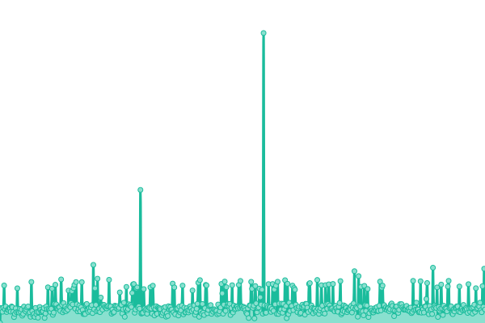
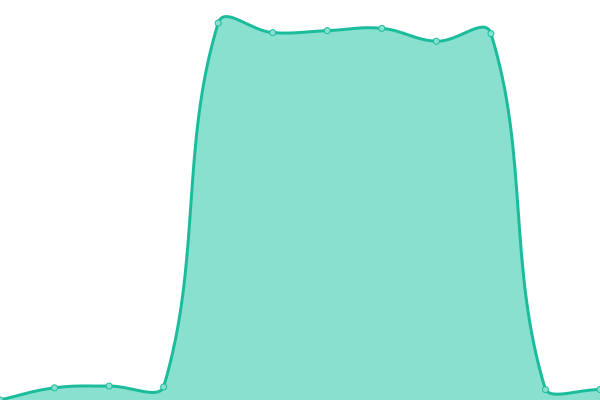

# [📈 Live Status](https://demo.upptime.js.org): <!--live status--> **🟩 All systems operational**

<!--start: status pages-->
<!-- This summary is generated by Upptime (https://github.com/upptime/upptime) -->
<!-- Do not edit this manually, your changes will be overwritten -->
<!-- prettier-ignore -->
| URL | Status | History | Response Time | Uptime |
| --- | ------ | ------- | ------------- | ------ |
|  [NEOCP](https://minorplanetcenter.net/iau/NEO/toconfirm_tabular.html) | 🟩 Up | [neocp.yml](https://github.com/Smithsonian/upptime/commits/HEAD/history/neocp.yml) | 

 250ms
     
 | 

<a href="https://status.minorplanetcenter.net/history/neocp">97.43%</a>
    

|  [MPC Homepage](https://www.minorplanetcenter.net) | 🟩 Up | [mpc-homepage.yml](https://github.com/Smithsonian/upptime/commits/HEAD/history/mpc-homepage.yml) | 

 250ms
     
 | 

<a href="https://status.minorplanetcenter.net/history/mpc-homepage">97.68%</a>
    

|  [MPC Data Services Homepage](https://data.minorplanetcenter.net/) | 🟩 Up | [mpc-data-services-homepage.yml](https://github.com/Smithsonian/upptime/commits/HEAD/history/mpc-data-services-homepage.yml) | 

 325ms
     
 | 

<a href="https://status.minorplanetcenter.net/history/mpc-data-services-homepage">100.00%</a>
    

|  [MPC Explorer](https://data.minorplanetcenter.net/explorer/) | 🟩 Up | [mpc-explorer.yml](https://github.com/Smithsonian/upptime/commits/HEAD/history/mpc-explorer.yml) | 

 95ms
     
 | 

<a href="https://status.minorplanetcenter.net/history/mpc-explorer">100.00%</a>
    

|  [Designation Identifier](https://data.minorplanetcenter.net/api/query-identifier) | 🟩 Up | [designation-identifier.yml](https://github.com/Smithsonian/upptime/commits/HEAD/history/designation-identifier.yml) | 

 161ms
     
 | 

<a href="https://status.minorplanetcenter.net/history/designation-identifier">100.00%</a>
    

<!--end: status pages-->

## 📄 License

- Powered by: [Upptime](https://github.com/upptime/upptime)
- Code: [MIT](./LICENSE) © [Anand Chowdhary](https://anandchowdhary.com), supported by [Pabio](https://pabio.com)
- Data in the `./history` directory: [Open Database License](https://opendatacommons.org/licenses/odbl/1-0/)
